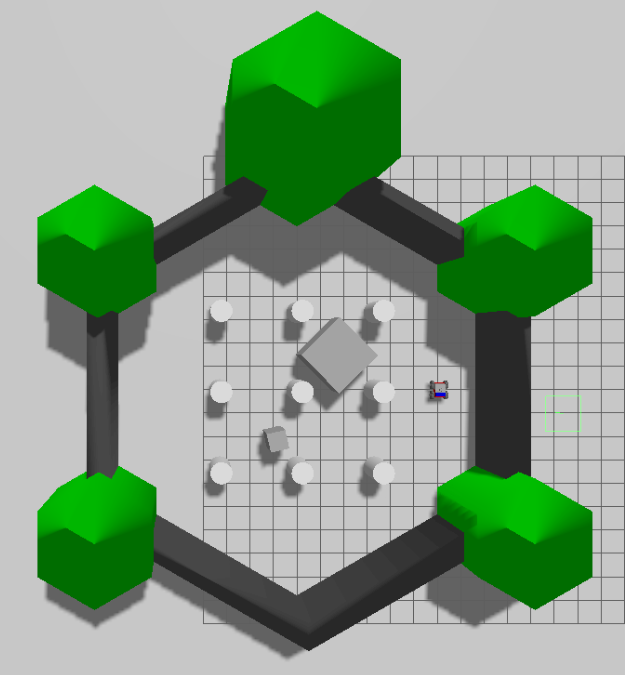
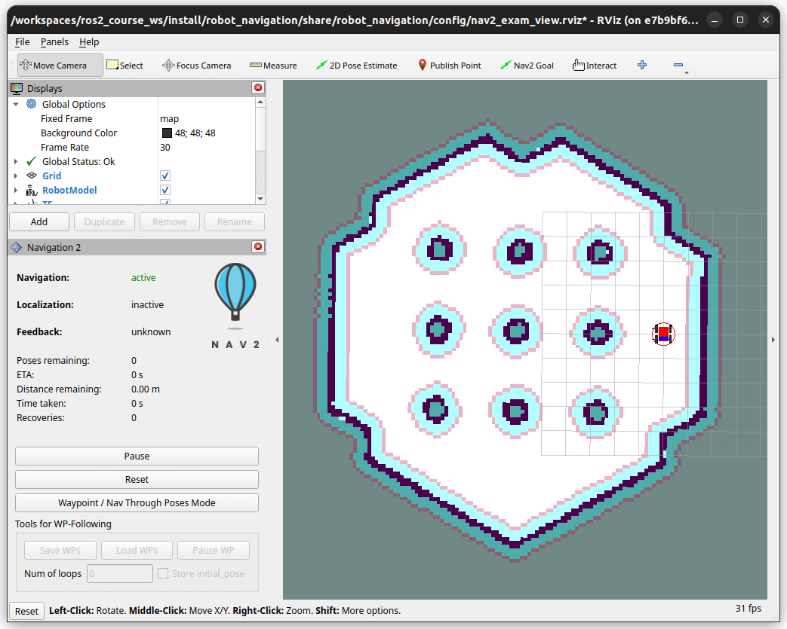
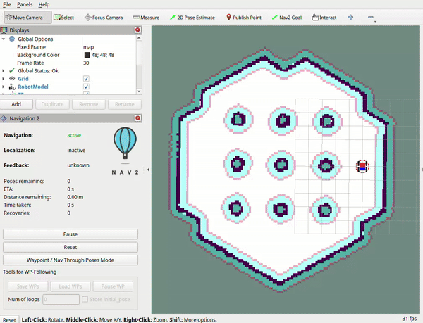
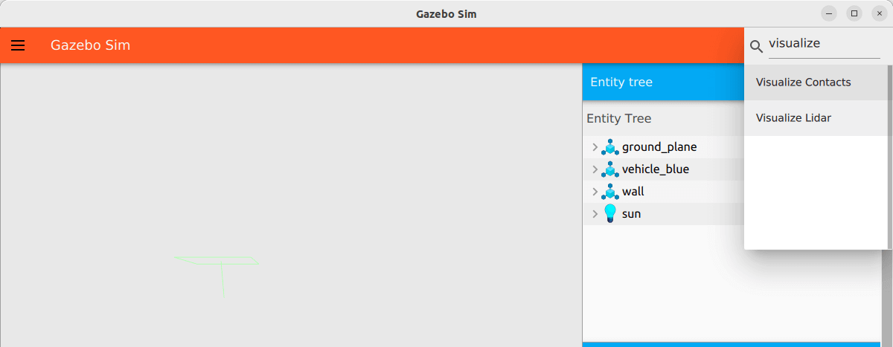
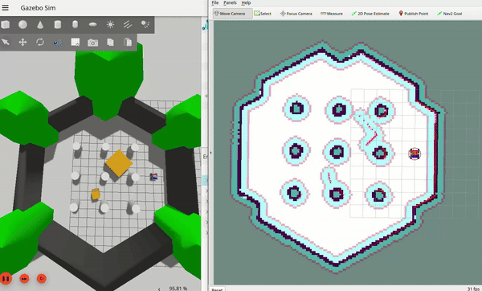

# ROS Exam Repository

This repository contains the ROS packages for your exam, you should **clone this repository into your colcon workspace**.

## Expected Result
If you successfully implement all tasks, your robot should be able to:
   1. Navigate autonomously through predefined waypoints
   2. Detect and avoid obstacles using sensor data
   3. Build and update an accurate map of the environment in real-time


## Exam Structure

The exam consists of **four** main packages:

1. **robot_description**: Contains the robot's URDF model.
2. **robot_gazebo**: Provides the Gazebo simulation environment.
   <p align="center">
      
   </p>
3. **robot_navigation**: Implements the navigation stack.
4. **exam_launch**: Provides the system launch files for the entire system, including the robot's URDF model, Gazebo simulation, and navigation stack. It contains two launch files:
   1. `system_bringup.example.launch.py`: Launch this file to familiarize yourself with the system and understand the limitations of the current implementation. It uses wheel odometry for localization, which estimates the robot's position by tracking wheel rotations from its starting point.
   2. `system_bringup.submission.launch.py`: Use this launch file to test your implementation. It incorporates your custom localization, occupancy grid update, and waypoint navigation nodes.

 
### Summary of all launch files

```bash
robot_description/
├── launch/
│   ├── robot_description.launch.py         # Loads URDF model and publishes /robot_description topic
│   └── visualize_robot_in_rviz2.launch.py  # Launches RViz2 for visualizing and debugging the URDF model
robot_gazebo/
├── launch/
│   └── robot_gazebo.launch.py              # Launches Gazebo simulation with specified world and spawn robot
exam_launch/
├── launch/
│   ├── system_bringup.submission.launch.py # Launch it to test your implementation
│   └── system_bringup.example.launch.py    # Launch it to get familiar with the system and understand the limitations
robot_navigation/
├── launch/
│   ├── nav2_bringup.launch.py              # Starts the navigation stack
│   └── robot_navigation.launch.py          # Starts the navigation stack and your custom follow_waypoints_action_client
```

## Tasks
### Task 0: Familiarize Yourself with the System
The navigation stack consists of several components that work together to enable autonomous navigation to predefined waypoints while avoiding obstacles. The key components include:

 - **Localization**: Determines the robot's position within the environment using sensor data and a provided map.
 - **Mapping**: Updates the environment map with real-time obstacle data from sensor data, as the initial map may not capture all obstacles.
 - **Global Path Planning**: Calculates optimal routes from current position to goals while avoiding known obstacles using the updated global map.
 - **Local Path Planning**: Executes planned paths while performing real-time obstacle avoidance using a local map centered on the robot.

To familiarize yourself with the system, build the workspace
```bash
colcon build --symlink-install
```
and then, launch the example system using the following command:
```bash
ros2 launch exam_launch system_bringup.example.launch.py
```
If the system is launched successfully, you should see the robot in the Gazebo simulation environment and the RViz2 as shown below

> [!NOTE]  
> If your RViz2 display shows no map and the Navigation 2 panel status remains "unknown", terminate the launch with a **single** `Ctrl+C` and restart the system. Multiple `Ctrl+C` presses may cause improper shutdown.

<p align="center">
   
</p>

Select the `Nav2 Goal` tool in RViz toolbar and click and drag to set a goal for the robot. The robot should plan a path to the goal and follow it. 
<p align="center">
   
</p>

Compare the Rviz display with the Gazebo simulation to understand the limitations of using wheel odometry for localization and a static map for planning.

---

In this exam, you will improve several key components of the navigation stack, including localization, map updates, and waypoint following.

### Task 1: Add lidar sensor to the robot ([robot.urdf.xacro](robot_description/urdf/robot.urdf.xacro))
#### Objective:
1. Attach a LiDAR mount link to the robot's base link.
2. Add a LiDAR sensor plugin to the LiDAR mount link.

#### Testing:
 - Launch `visualize_robot_in_rviz2.launch.py` to visualize verify the LiDAR mount link is correctly attached to the robot.
 - Load `Visualize Lidar` GUI in Gazebo to verify the LiDAR sensor plugin is correctly attached to the LiDAR mount link.
   <p align="center">
       
   </p>
- Echo the `/scan` topic to verify the LiDAR sensor is publishing data:
    ```sh
    ros2 topic echo /scan
    ```


### Task 2: Robot Localization ([DummyLocalization.cpp](robot_navigation/src/DummyLocalization.cpp))


There is an onboard sensor that publishes precise robot pose in the simulation world frame on the `/robot_pose` topic. However, the sensor only publish the pose without the timestamp. For simplicity, we will assume the pose is published at the current simulation time and world, map and odom frames are the same. In the [system launch file](exam_launch/launch/system_bringup.submission.launch.py)
, we will publish a identity transformation from `map` to `odom` frame for the navigation stack to work.

#### Objective:

Implement a node that:
1. Subscribes to the `/robot_pose` topic to get the pose of the `base_link` of the robot in the world frame.
2. Publishes stamped transformation(TF) from `odom` to `base_link` based on the `/robot_pose` topic. The timestamp of the transformation should be the current simulation time.

#### Hints:
- Simulation Time:
    Ensure the node uses simulation time published by the Gazebo simulation. This can be achieved by setting the `use_sim_time` parameter to `true` and use `rclcpp::Clock` to get the current simulation time. For more details, refer to the [ROS 2 Clock and Time](https://design.ros2.org/articles/clock_and_time.html).

#### Testing:
 - Launch simulation
      ```bash
      ros2 launch robot_gazebo robot_gazebo.launch.py
      ```
 - Launch the `DummyLocalization` node using `ros2 run` command.
 - Verify the transforms using `tf2_tools`:
    ```sh
   ros2 run tf2_tools view_frames
   ```

### Task 3: Update global map with lidar scan data ([UpdateOccupancy.cpp](robot_navigation/src/UpdateOccupancy.cpp))

After successfully implementing the LiDAR sensor (Task 1) and robot localization (Task 2), we can now use this information to update the global occupancy grid map. This task involves:
1. Getting LiDAR scan data in the local sensor frame
2. Using the robot's pose to transform this data into the map frame
3. Updating the global occupancy grid map with the transformed data

This updated map will help the navigation stack better understand the environment and plan safer paths around obstacles.


#### Objective
Look up transform between the LiDAR frame and the `map` frame and write transformed point cloud data in the map frame to `latest_cloud_`.

#### Hints:
 - Transforming Point Clouds: 
    - You are given a pointer to the tf2_ros::Buffer object `tf_` which can be used to look up transforms between frames.
    - Use `tf2::doTransform` to apply the transform to each point in the point cloud.

#### Testing:
 - Launch the system using the following command:
    ```sh
    ros2 launch exam_launch system_bringup.submission.launch.py
    ```
 - Check the RViz display:
   - **LaserScan**: Displays the raw LiDAR data from the `/scan` topic. This should show the obstacles detected by the LiDAR sensor.
   - **Map**: Displays the static global occupancy grid map. 
   - **Global Planner**:
      - **Global Costmap**: Displays the global costmap used by the global planner. This should include the provided environment map as well as the obstacles added by your node.
      - **Path**: Displays the calculated path to the next waypoint. This should avoid obstacles and follow the global costmap.
   - You can drive the robot and check the updates in the **Global Costmap**.
   - Use the `Nav2 Goal` tool in RViz to set a goal for the robot and verify that the path is planned correctly.
   - On incorrect transformations: If the point cloud is not correctly transformed to the map frame, the global planner may plan a path through obstacles, but the local planner will refuse to execute, causing the robot to get stuck.

### Task 4: Waypoint Navigation ([FollowWaypointsActionClient.cpp](robot_navigation/src/FollowWaypointsActionClient.cpp))

Finally, you will implement a waypoint following action client that sends [predefined waypoints](robot_navigation/config/waypoints.yaml) to the `/follow_waypoints` action server. The action server will then guide the robot to follow the waypoints while avoiding obstacles.

#### Objective
Implement a waypoint following action client that:

1. Send `/follow_waypoints` action goals to the action server.
2. Handle the action server's feedback and result, including printing the missed waypoint indexes.

#### Hints:
 - Action Client:
    - Use `rclcpp_action::create_client` to create an action client for the `/follow_waypoints` action. Refer to [Writing an action server and client](https://docs.ros.org/en/jazzy/Tutorials/Intermediate/Writing-an-Action-Server-Client/Cpp.html)
    - Define the goal message `nav2_msgs::action::FollowWaypoints::Goal` and populate it with the loaded waypoints.
 - Testing:
    - Check the robot's path in RViz to verify that it reaches all waypoints.

#### Testing:
1. Launch the complete system:
   ```sh
   ros2 launch exam_launch system_bringup.submission.launch.py
   ```
   The action client will send waypoints to the action server once and exit.

2. To resend waypoints:
   - The action client is designed for single use (send once and shutdown)
   - To send waypoints again, manually run the action client:
   ```sh
   ros2 run robot_navigation ...
   ```

Monitor RViz to verify the robot follows waypoints and avoids obstacles correctly.

### Task 5: Prepare for submission

You need to prepare an updated global map, a rosbag, and a screen recording for submission. You may have to launch the system multiple times to record different components. We do not require all components to be recorded in a single run.

#### Tips:
- To manually control when to send waypoints, first comment out the `waypoint_action_client_node` from the `LaunchDescription` in [robot_navigation.launch.py](robot_navigation/launch/robot_navigation.launch.py). Then run it manually using:
   ```sh
   ros2 run robot_navigation follow_waypoints_action_client --ros-args -p waypoints_file_path:=<path_to_waypoints.yaml>
   ```

#### Steps to record a rosbag:
1. Launch the system:
   ```bash
   ros2 launch exam_launch system_bringup.submission.launch.py
   ```
2. Run rosbag record with the following topics:
   ```bash
   ros2 bag record --use-sim-time \
    /my_hostname \
    /my_student_id \
    /robot_pose \
    /scan \
    /tf \
    /tf_static \
    /waypoint_markers \
    /global_costmap/costmap \
    /clock
   ```
3. Run `waypoint_action_client_node` to send waypoints to the robot.
4. Once the robot has successfully followed all waypoints, stop the rosbag recording.

#### Steps to save the updated global map:
1. Launch the system:
   ```sh
   ros2 launch exam_launch system_bringup.submission.launch.py
   ```

2. Once the robot has successfully followed all waypoints, call [/save_map](https://github.com/ros-navigation/navigation2/blob/main/nav2_msgs/srv/SaveMap.srv) service to save the obtained global cost map from topic `/global_costmap/costmap`.
   - Ensure the map is saved in `png` format, and `trinary` mode.

#### Steps to record a screen recording:
1. Launch the system:
   ```sh
   ros2 launch exam_launch system_bringup.submission.launch.py
   ```
2. Record RViz2 and Gazebo simulation windows while the robot navigates through waypoints:
   - Start recording before launching the waypoint navigation
   - Show the robot's complete journey from initial position to final waypoint
   - Ensure both RViz2 and Gazebo windows are visible in the recording. The recording should look similar to the example below:
   <p align="center">
      
   </p>


## ⚠️ Exam Submission ⚠️
- **Map**: Save the generated global map in the `exam_submission/map` folder. Name the map `map.png` and `map.yaml`.
- **Rosbag**: Save the recorded rosbag in the `exam_submission/rosbag` folder. Name the rosbag folder `rosbag`.
- **Screen_recording**: Record Rviz2 and Gazebo simulation while the robot is navigating through waypoints. Save the recording at the `exam_submission/screen_recording/recording.mp4`. 

The final directory structure should look like this:
```
exam_submission/
├── map/
│   ├── map.png
│   └── map.yaml
├── rosbag/
│   └── rosbag/
│       ├── metadata.yaml
│       └── rosbag_0.mcap
└── screen_recording/
   └── recording.mp4
```

Finally, compress the whole `ros_exam` folder and submit it.
